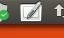
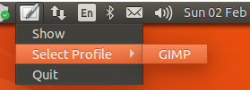
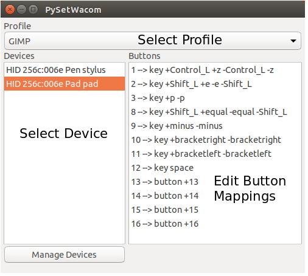
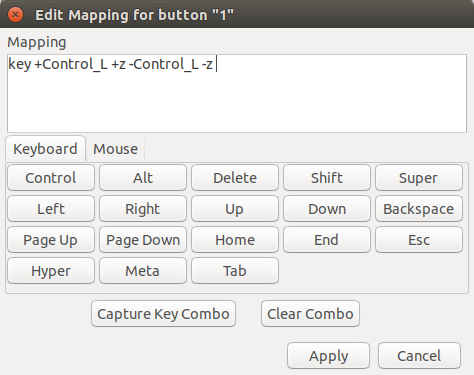
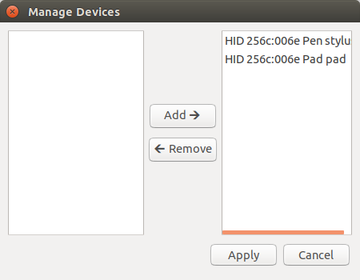

**********************
PySetWacom
**********************

.. image:: https://travis-ci.com/domdfcoding/PySetWacom.svg?branch=master
	:target: https://travis-ci.com/domdfcoding/PySetWacom
	:alt: Build Status
.. image:: https://readthedocs.org/projects/pysetwacom/badge/?version=latest
	:target: https://pysetwacom.readthedocs.io/en/latest/?badge=latest
	:alt: Documentation Status
.. image:: https://img.shields.io/pypi/v/pysetwacom.svg
	:target: https://pypi.org/project/pysetwacom/
	:alt: PyPI
.. image:: https://img.shields.io/pypi/pyversions/PySetWacom.svg
	:target: https://pypi.org/project/PySetWacom/
	:alt: PyPI - Python Version

A GUI utility for configuring buttons on graphics tablets and styli, using the xsetwacom utility.

Dependencies
=============

xsetwacom must be installed for this program to function. Python dependencies include:

.. code-block:: bash

	appdirs>=1.4.3
	domdf_python_tools>=0.1.17
	domdf_wxpython_tools>=0.2.0
	Pypubsub>=4.0.3
	pid>=2.2.5
	sh>=1.12.14

These can all be installed using ``pip``.

wxPython (4.0.7 or greater) must also be installed. See https://wxpython.org/pages/downloads/ for more information and installation instructions.

PyGObject must also be installed. See https://pygobject.readthedocs.io/en/latest/ for more information and installation instructions.

Depending on your tablet model you may need to install DIGImend_. See https://digimend.github.io/ for further information, a list of supported devices, and installation instructions.

.. _DIGImend: https://digimend.github.io/

Brief Tutorial
================

`PySetWacom` can be run from the terminal with the command

.. code-block:: bash

	$ PySetWacom

or by selecting its icon from your application menu.

AppIndicator
---------------

Once started, you should see an AppIndicator icon appear that looks like this:

You can click this icon to show the `Editor` window, switch profiles, or quit `PySetWacom`.

Editor
-------

In the `Editor` window, you can change profiles and edit the mappings for the different buttons on your tablet.

Double clicking on a button opens the `Edit Mapping` dialog, where you can type in the mapping or capture it from your keyboard.

If there are devices in the list that you don't want to configure, or if there is a new device you want to add, you can click the `Manage Devices` button in the `Editor` window.

