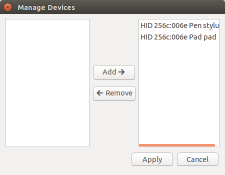

======================
PySetWacom
======================

.. start shields

.. list-table::
	:stub-columns: 1
	:widths: 10 90

	* - Docs
	  - |docs| |docs_check|
	* - Tests
	  - |travis| |codefactor| |pre_commit_ci|
	* - PyPI
	  - |pypi-version| |supported-versions| |supported-implementations| |wheel|
	* - Activity
	  - |commits-latest| |commits-since| |maintained|
	* - Other
	  - |license| |language| |requires| |pre_commit|

.. |docs| rtfd-shield::
	:project: pysetwacom
	:alt: Documentation Build Status

.. |docs_check| actions-shield::
	:workflow: Docs Check
	:alt: Docs Check Status

.. |travis| actions-shield::
	:workflow: Linux Tests
	:alt: Linux Test Status

.. |requires| requires-io-shield::
	:alt: Requirements Status

.. |codefactor| codefactor-shield::
	:alt: CodeFactor Grade

.. |pypi-version| pypi-shield::
	:project: PySetWacom
	:version:
	:alt: PyPI - Package Version

.. |supported-versions| pypi-shield::
	:project: PySetWacom
	:py-versions:
	:alt: PyPI - Supported Python Versions

.. |supported-implementations| pypi-shield::
	:project: PySetWacom
	:implementations:
	:alt: PyPI - Supported Implementations

.. |wheel| pypi-shield::
	:project: PySetWacom
	:wheel:
	:alt: PyPI - Wheel

.. |license| github-shield::
	:license:
	:alt: License

.. |language| github-shield::
	:top-language:
	:alt: GitHub top language

.. |commits-since| github-shield::
	:commits-since: v0.1.8
	:alt: GitHub commits since tagged version

.. |commits-latest| github-shield::
	:last-commit:
	:alt: GitHub last commit

.. |maintained| maintained-shield:: 2020
	:alt: Maintenance

.. |pre_commit| pre-commit-shield::
	:alt: pre-commit

.. |pre_commit_ci| pre-commit-ci-shield::
	:alt: pre-commit.ci status

.. end shields

A GUI utility for configuring buttons on graphics tablets and styli, using the xsetwacom utility.

Installation
----------------

Before installing ``PySetWacom`` ensure you have installed the following:

* ``xsetwacom``. This may be installed by default.
* ``PyGObject``. See https://pygobject.readthedocs.io/en/latest/ for more information and installation instructions.

	On Ubuntu you may need to install ``libgirepository1.0-dev``, ``libcairo2-dev`` and ``python3-gi``.

* ``wxPython`` (version 4.0.7 or greater). See https://wxpython.org/pages/downloads/ for more information and installation instructions.

	On Ubuntu you may also need to install ``libsdl2-2.0.0``.

Depending on your tablet model you may need to install DIGImend_. See https://digimend.github.io/ for further information, a list of supported devices, and installation instructions.

.. _DIGImend: https://digimend.github.io/

.. start installation

.. installation:: PySetWacom
	:pypi:
	:github:

.. end installation

Brief Tutorial
================

`PySetWacom` can be run from the terminal with the command

.. code-block:: bash

	$ PySetWacom

or by selecting its icon from your application menu.

AppIndicator
---------------

Once started, you should see an AppIndicator icon appear that looks like this:

.. image:: images/AppIndicator.png

You can click this icon to show the `Editor` window, switch profiles, or quit `PySetWacom`.

Editor
-------

In the `Editor` window, you can change profiles and edit the mappings for the different buttons on your tablet.

.. image:: images/Editor.png
	:width: 400

Double clicking on a button opens the `Edit Mapping` dialog, where you can type in the mapping or capture it from your keyboard.

.. image:: images/Edit_Mapping.png
	:width: 400

If there are devices in the list that you don't want to configure, or if there is a new device you want to add, you can click the `Manage Devices` button in the `Editor` window.

Further Reading
================

https://github.com/linuxwacom/xf86-input-wacom/wiki/Tablet-Configuration-1:-xsetwacom-and-xorg.conf
https://github.com/linuxwacom/xf86-input-wacom/wiki/xsetwacom
https://www.x.org/releases/current/doc/man/man4/mousedrv.4.xhtml
https://wiki.archlinux.org/index.php/Wacom_tablet

.. toctree::
    :maxdepth: 3
    :caption: Documentation

    docs

.. start links

View the :ref:`Function Index <genindex>` or browse the `Source Code <_modules/index.html>`__.

`Browse the GitHub Repository <https://github.com/domdfcoding/PySetWacom>`__

.. end links
